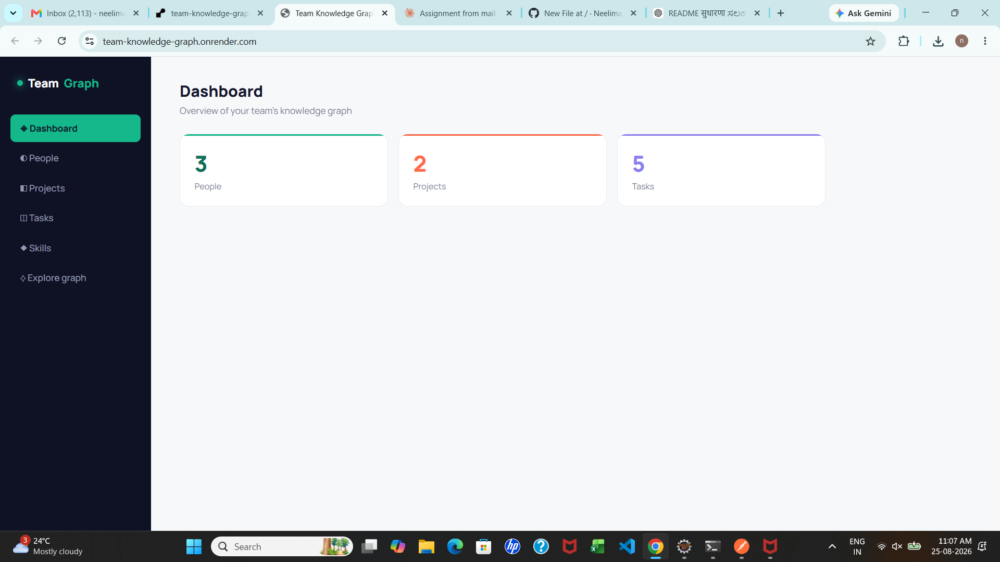
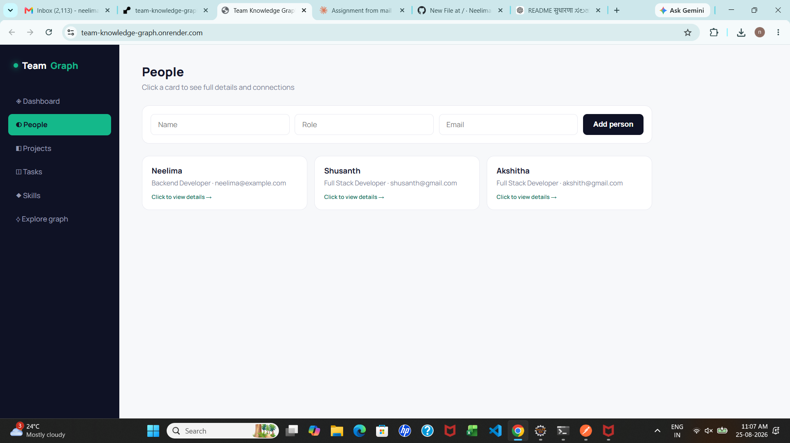
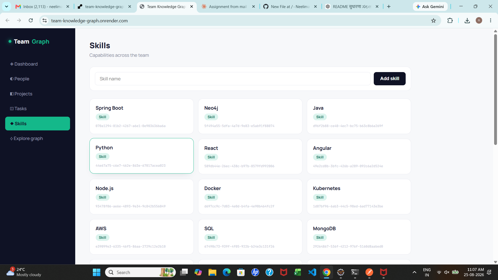
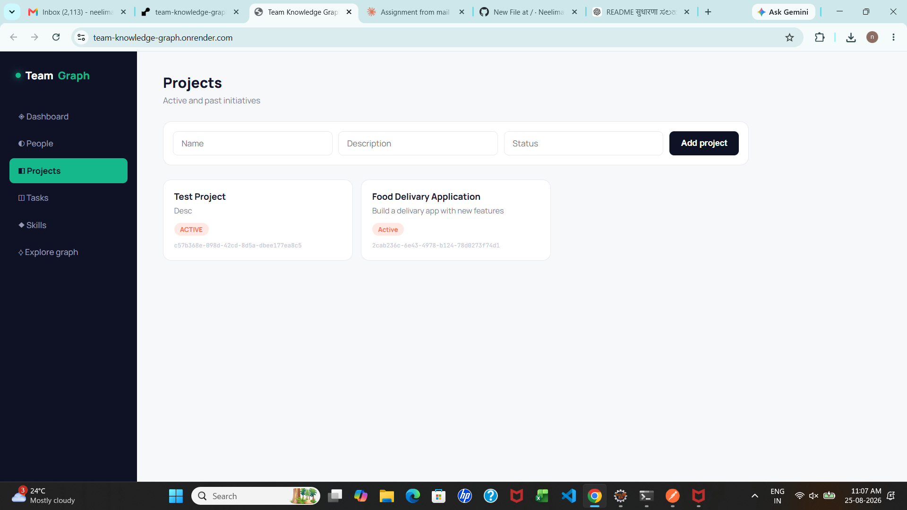
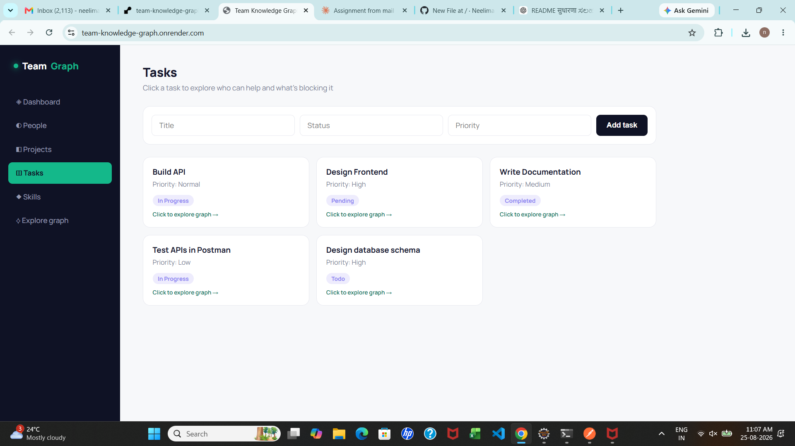
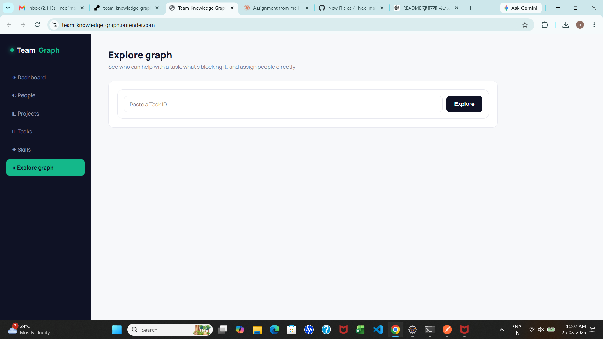

# Team Knowledge Graph

A small full-stack application that models a team's people, projects, tasks, and skills as a **graph**, backed by CognoDB (a managed graph database speaking openCypher over Bolt). Built for the Wexa AI take-home assignment.

**Live demo:** https://team-knowledge-graph.onrender.com
*(First load may take 30–60s if the free-tier server has gone to sleep.)*

## Use case

This app is a mini "team knowledge graph" — similar in spirit to what Wexa AI builds at enterprise scale (a context graph connecting people, tools, and work). It answers questions like:

- **Who can help unblock this task?** — find people connected through project membership and matching skills
- **What's blocking this task?** — trace a chain of task dependencies
- **What does someone work on, and what skills do they have?** — a live, browsable profile

### Why a graph database?

The interesting questions here are about **connections between entities**, not isolated records:

- "Who can help with this task" requires traversing Task → required Skill → People who have that skill — a 2-hop relationship query.
- "What's blocking this task" requires following a chain of task dependencies of *arbitrary length* — Task A depends on B depends on C, and so on. In SQL this needs a recursive CTE; in Cypher it's a single pattern: `(t:Task)-[:DEPENDS_ON*1..5]->(blocker:Task)`.

A relational schema would need multiple JOIN tables and recursive queries to answer these; a graph model answers them with a single readable traversal.

## Data model

**Nodes:** `Person`, `Project`, `Task`, `Skill`

**Relationships:**
- `(Person)-[:WORKS_ON]->(Project)`
- `(Person)-[:ASSIGNED_TO]->(Task)`
- `(Person)-[:HAS_SKILL]->(Skill)`
- `(Task)-[:BELONGS_TO]->(Project)`
- `(Task)-[:REQUIRES]->(Skill)`
- `(Task)-[:DEPENDS_ON]->(Task)` *(self-relationship — enables multi-hop dependency chains)*

## Tech stack

- **Backend:** Java, Spring Boot, Spring Data Neo4j (official Neo4j driver, compatible with CognoDB's Bolt protocol)
- **Database:** CognoDB Cloud (free tier)
- **Frontend:** Plain HTML/CSS/JavaScript, served as static resources from Spring Boot
- **Deployment:** Docker + Render

## Key queries

**1. Multi-hop traversal — "Who can help with this task?"**
```cypher
MATCH (t:Task {id: $taskId})-[:REQUIRES]->(s:Skill)<-[:HAS_SKILL]-(p:Person)
RETURN DISTINCT p.id AS id, p.name AS name, p.role AS role, p.email AS email
```
A 2-hop traversal from Task through Skill to matching People.

**2. Variable-length path — "What's blocking this task?"**
```cypher
MATCH (t:Task {id: $taskId})-[:DEPENDS_ON*1..5]->(blocker:Task)
RETURN DISTINCT blocker
```
Finds all tasks that transitively block a given task, up to 5 hops deep. This is the kind of query that's awkward in SQL (requires recursive CTEs) but natural in Cypher.

Both queries use parameterized Cypher via the official Spring Data Neo4j / Neo4j driver — no string concatenation.

## Setup and running locally

### 1. Create a CognoDB instance
1. Sign up at [console.cognodb.com](https://console.cognodb.com/signup) (free, no card required)
2. Create a free (c0) instance
3. Copy the connection URI (`bolt+s://...`) and password (shown once)

### 2. Set environment variables
- COGNODB_URI=bolt+s://<your-instance>.databases.cognodb.cloud:7687
- COGNODB_PASSWORD=<your-password>

### 3. Run
```bash
git clone https://github.com/NeelimaUsurupati-03/team-knowledge-graph.git
cd team-knowledge-graph
./mvnw spring-boot:run
```
Then open `http://localhost:8080`

Seed data (30 common skills) loads automatically on first startup.

### 4. Run with Docker
```bash
docker build -t team-knowledge-graph .
docker run -p 8080:8080 -e COGNODB_URI=... -e COGNODB_PASSWORD=... team-knowledge-graph
```

## Project structure
src/main/java/com/neelima/teamknowledgegraph/
├── config/ # CORS config, seed data loader
├── controller/ # REST endpoints
├── service/ # Business logic
├── repository/ # Spring Data Neo4j repositories with Cypher queries
└── model/ # Graph node entities (Person, Project, Task, Skill)
src/main/resources/
└── static/index.html # Frontend

## Error handling

If CognoDB is unreachable, the frontend detects the failed API call and displays a clear message instead of a blank page or crash.

## Screenshots

### Dashboard


### People & Skills



### Projects & Tasks



### Graph Explorer


## Demo Video

Watch full demo of Team Graph (Knowledge Graph System) here:
https://drive.google.com/file/d/12-sIbnijoBEDzRmy_xV4KjkXR0velW0m/view?usp=sharing

Features demonstrated:
- Dashboard with stats (People, Projects, Skills)
- People Management 
- Projects & Tasks with graph relations
- Skills Management (your "Skill added!" popup)
- Graph Visualization - Explore graph
